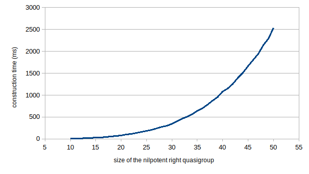

# <!-- fit --> Chapter 3: Libraries

- Libraries
- Random right quasigroups
- Exotic constructors

---

# Databases

* automorphic loops  
* CC loops / LCC loops / RCC loops
* Moufang loops / Paige loops / code loops
* left Bol loops / right Bol loops / left Bruck loops / right Bruck loops
* Steiner loops
* nilpotent loops
* small loops / small loops up to isotopism / interesting loops
* small quandles / small racks / connected quandles

---

# `DisplayLibraryInfo`

```
for libname in [
        "automorphic loops", 
        "CC loops", "LCC loops", "RCC loops", 
        "Moufang loops", "Paige loops", "code loops", 
        "left Bol loops", "left Bruck loops", 
        "right Bol loops", "right Bruck loops", 
        "Steiner loops", "nilpotent loops", 
        "small loops", "itp small loops", "interesting loops", 
        "small quandles", "small racks", "connected quandles"
    ] do
    Print( "\n### Library \"", libname, "\" ###\n" );
    DisplayLibraryInfo( libname ); 
od;
```

---

# Library of code loops

> **Definition** Code loops are Moufang loops $Q$ containing a central subloop $Z$ of order 2 such that $Q/Z$  is an elementary abelian 2-group

```
gap> DisplayLibraryInfo( "code loops" );
The library contains all code loops of order less than 512.
------
Extent of the library:
   1 algebra of order 2
   2 algebras of order 4
   4 algebras of order 8
   10 algebras of order 16
   23 algebras of order 32
   88 algebras of order 64
   767 algebras of order 128
   80826 algebras of order 256
true
```

* There are **937'791'557** code loops of order **512** ([O'Brien, Vojtěchovský 2017](https://doi.org/10.1016/j.jalgebra.2016.11.006))

---

# Properties of library right quasigroups

* Library right quasigroups are always index based
  ```
  gap> L:=CodeLoop(16,10);
  CodeLoop( 16, 10 )
  gap> IsIndexBased(L);
  true
  ```
* Many properties are preset
  ```
  gap> KnownTruePropertiesOfObject(L);
  [ "IsNonTrivial", "IsFinite", "IsDuplicateFree",  ...  
  "IsMiddleNuclearSquareLoop", "IsMoufangLoop", "IsRCLoop", 
  "IsRightBolLoop", ... ]
  ```
* The `UnderlyingSet`  reflects the construction method
  ```
  gap> UnderlyingSet(L);
  [ [ 0, [ 0, 0, 0 ] ], [ 0, [ 0, 0, 1 ] ], ... , [ 1, [ 1, 1, 1 ] ] ]
  ```
---

# Random (right) quasigroups

* **Random magmas** are **trivial:** generate each cell of the Cayley table uniformly at random
* **Random right quasigroups** are **easy:** generate each row of the multiplication table as an independent random permutation
* Random quasigroups are the same as random latin squares
* This **hard problem** has been solved by the celebrated paper 
  > M. T. Jacobson and P. Matthews, [Generating uniformly distributed random Latin squares](https://doi.org/10.1002/(SICI)1520-6610(1996)4:6%3C405::AID-JCD3%3E3.0.CO;2-J), J. Combinatorial Design 4 (1996), 405-437
* Random loops can be obtained from random quasigroups by normalization (principal isotope)

---

# The Jacobson-Matthews method

* We fix $n$ and consider $n\times n$ tables 
* Let $\mathcal{L}$ be the set of **proper** latin squares
* Introduce the concept of **improper** latin squares
* Let $\mathcal{L}'$ be the set of all **proper** and **improper** latin squares
* Make $\mathcal{L}'$ into a graph by defining *"moves"* on the elements
* Difficult:
  >**Theorem 1** The graph is connected with diameter at most $4(n-1)^2$.
  **Theorem 2** The average distance between proper latin squares is at most $n$. 
* Random walks in this graph give a Monte Carlo algorithm to generate latin squares uniformly at random
* **Question:** How to know when to stop?

---

# Improper latin squares

* The $n$ symbols are variables $a,b,c,\ldots$
* We introduce the concept of an **improper** LS:
  $$\begin{bmatrix}
  a&c&b&d \\
  b&b&d+c-b&a \\
  c&d&a&b\\
  d&a&b&c
  \end{bmatrix}$$
* An improper LS has a unique entry of the form $x+y-z$
* All rows and columns *sum up* to $a+b+c+\cdots$
* The symbol $z$ has exactly two further occurences in the row and column of the improper entry

---

# The Jacobson-Matthews move for a proper LS

* Moves modify a $2\times 2$ subsquare
  $$
  \begin{bmatrix}
  &\vdots&&\vdots& \\
  \cdots&x&\cdots&y&\cdots \\
  &\vdots&&\vdots& \\
  \cdots&y&\cdots&z&\cdots \\
  &\vdots&&\vdots& \\
  \end{bmatrix}
  \longrightarrow
  \begin{bmatrix}
  &\vdots&&\vdots& \\
  \cdots&y&\cdots&x&\cdots \\
  &\vdots&&\vdots& \\
  \cdots&x&\cdots&z-x+y&\cdots \\
  &\vdots&&\vdots& \\
  \end{bmatrix}
  $$
* There are $n^2(n-1)$ such subsquares

---

# The Jacobson-Matthews move for an improper LS

- Moves modify a $2\times 2$ subsquare
  $$
  \begin{bmatrix}
  &\vdots&&\vdots& \\
  \cdots&u-v+w&\cdots&v&\cdots \\
  &\vdots&&\vdots& \\
  \cdots&v&\cdots&w'&\cdots \\
  &\vdots&&\vdots& \\
  \end{bmatrix}
  \longrightarrow
  \begin{bmatrix}
  &\vdots&&\vdots& \\
  \cdots&u&\cdots&w&\cdots \\
  &\vdots&&\vdots& \\
  \cdots&w&\cdots&w'+v-w&\cdots \\
  &\vdots&&\vdots& \\
  \end{bmatrix}
  $$
* There are 8 such subsquares
* The result is proper if and only if $w=w'$
* **Important:** No more than one improper entry

---

# Time complexity of `RandomQuasigroup`

- Number of iterations = $n^3$
  


---

# Random nilpotent loops

* Nilpotent loops have an efficient construction method using **factor sets**
* **Random central extensions** are generated by random factor sets 
* Random nilpotent loops are given by the list of the **composition factors**
  ```
  gap> L := RandomNilpotentLoop( [ Group((1,2)), ElementaryAbelianGroup(32) ] ); time;
  <loop of size 64>
  39
  gap> Size( AutomorphismGroup( L ) ); time;
  32
  1774
  ```
* Compare this with random loops:
  ```
  gap> L := RandomLoop( 64 ); time;
  <loop of size 64>
  7205
  gap> Size( AutomorphismGroup( L ) ); time;
  1
  151
  ```
---

# Exotic constructors: Loops by (right) loop folders

> **Definition (Aschbacher)** Let $G$ be a group, $H\leq G$ a subgroup and $K\subset G$ a subset such that $1\in K$ and for each conjugate $H^g$ of $H$, $K$ is a set of right coset representatives. Then $(G,H,K)$ is called a **loop folder**.

* For $x,y\in K$ define
  $$x*y=z,$$
  where $\{z\}=K\cap Hxy$. 
* Then $(K,*,1)$ is the loop associated to the loop folder
* An almost trivial example:
  ```
  gap> G := SymmetricGroup( 3 );; H := Subgroup( G, [()] );;
  gap> LoopByRightFolder( G, H, Elements( G ) );
  <loop of size 6>
  gap> IsAssociative( last );
  true
  ```

---

# Exotic constructors: Right Bol loops by exact factorizations

* **Right Bol loop:** Loop with the rigth Bol identity
  $$(xy\cdot z)y=x(yz\cdot y)$$
* **Twisted subgroup:** $K\subset G$ such that $1\in K$ and $xyx\in K$ for all $x,y\in K$
* The **anti-diagonal** $\{(x,x^{-1}) \mid x \in G\}$ is a twisted subgroup in $G\times G$
* The loop folder $(G,H,K)$ is a **Bol loop folder**, if $K$ is a **twisted subgroup** in $G$
* **Exact factorization:** subgroups $A,B$ of $G$ s. t. $G=AB$ and $A\cap B=1$
* *Example:* Let $G$ be a transitive permutation group, and $A$ a regular subgroup. Let $B$ be the stabilizer of an element in $G$. Then $G=AB$ is an exact factorization
  
---

# Exotic constructors: Right Bol loops by exact factorizations

> **Theorem (GN 2007):** Let $G=AB$ be an exact factorization. Let $K$ be the anti-diagonal in $G\times G$. Then $(G\times G, A\times B, K)$ is a Bol loop folder.

```
gap> G:=SymmetricGroup(4); A:=Group((1,2,3,4)); B:=Stabilizer(G,1);
Sym( [ 1 .. 4 ] )
Group([ (1,2,3,4) ])
Sym( [ 2 .. 4 ] )
gap> L:=RightBolLoopByExactGroupFactorization(G,A,B);
<right Bol loop of size 24>
gap> IsSimple(L);
true
```

---

# The same by loop folders

```
gap> GxG:=DirectProduct(G,G);
Group([ (1,2,3,4), (1,2), (5,6,7,8), (5,6) ])
gap> Ax:=Image(Embedding(GxG,1),A);
Group([ (1,2,3,4) ])
gap> Bx:=Image(Embedding(GxG,2),B);
Group([ (6,7,8), (6,7) ])
gap> AxB:=ClosureGroup(Ax,Bx);
Group([ (1,2,3,4), (6,7,8), (6,7) ])
gap> K:=Set(G,x->Image(Embedding(GxG,1),x)*Image(Embedding(GxG,2),x^-1));;
gap> M:=LoopByRightFolder(GxG,AxB,K);
<loop of size 24>
gap> IsomorphismLoops(L,M);
MappingByFunction( <right Bol loop of size 24>, <loop of size 24>, 
>function( x ) ... end )
```